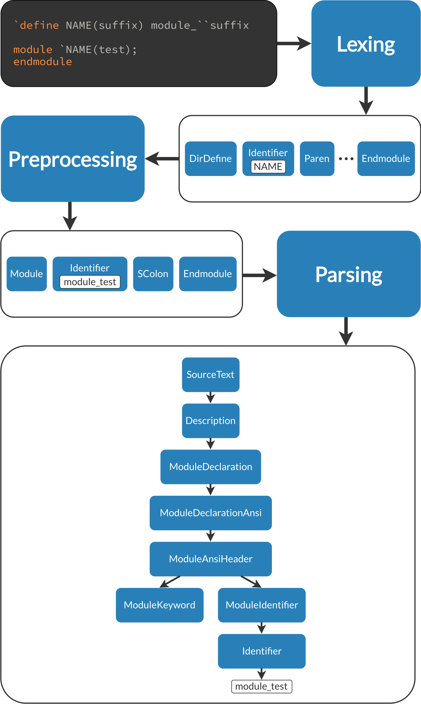

Parsing SystemVerilog Source Text
==========================================================================

Parsing source code involves creating a CST (Concrete Syntax Tree) out of
raw text, so that the structure of the code can be understood and operated
on. ``scarf`` separates this process out into three common phases:

* **Lexing**: Separate the file content into individual semantic tokens
* **Preprocessing**: Elaborate any preprocessor/compiler directives

  * Note that this requires destructively changing the token stream, and
    is a one-way operation; a source file cannot be recovered from a CST
    (although an equivalent one with no preprocessor directives could be
    constructed)

* **Parsing**: Organize the tokens into a tree of SystemVerilog language
  constructs (as defined in `IEEE 1800-2023 <https://ieeexplore.ieee.org/document/10458102>`_, Annex A)

.. admonition:: CST vs. AST
   :class: note

   ``scarf`` specifically produces a CST, not an AST (Abstract Syntax Tree),
   as location information is retained throughout parsing. Lexing and
   preprocessing both produce streams of :py:class:`SpannedToken`, which
   associate each lexical :py:class:`Token` with a :py:class:`Span`
   identifying where it belongs in the source file. Similarly, a :py:class:`Node`
   in the tree produced by parsing has a :py:attr:`Node.span` attribute

Lexing
--------------------------------------------------------------------------

The :py:func:`lex` function is provided to separate a source file into
a stream of spanned tokens (:py:class:`SpannedToken`). Each :py:class:`Token`
is one of many subclasses (which can be checked using ``isinstance``, or
structural pattern matching if using Python 3.10+). A :py:class:`Token.Error`
indicates a section that wasn't recognized as a valid slice of SystemVerilog
text.

Lexing requires both the content of the source file, as well as its name
(to use as the file name in :py:class:`Span`\ s).

Preprocessing
--------------------------------------------------------------------------

To preprocess a file from the initial source text, use the
:py:func:`preprocess` function, which combines the lexing and preprocessing
steps. This lexes the source file, and then elaborates any and all
preprocessor/compiler directives, such as conditional directives, text macros,
etc. The output of :py:func:`preprocess` is a :py:class:`PreprocessorResult`;
this either contains a successfully preprocessed stream of :py:class:`SpannedToken`\ ,
or a :py:class:`PreprocessorError`\ (s) explaining what went wrong.

In addition to the file content and name, :py:func:`preprocess` also requires
a list of include paths (to search when expanding ``include`` directives),
as well as any initial preprocessor definitions - see :py:class:`Define`.

If you feel the need to modify the token stream in between lexing and
preprocessing, you can use :py:func:`preprocess_from_lex` to preprocess an
existing token stream; however, this incurs substantial overhead when
compared to :py:func:`preprocess` due to copying data between Rust and
Python ownership models, and isn't recommended.

Parsing
--------------------------------------------------------------------------

To parse a file from the initial source text, use the :py:func:`parse`
function. This has the same inputs as :py:func:`preprocess`, but instead
parses the token stream into a Concrete Syntax Tree. The output of :py:func:`parse`
is a :py:class:`ParserResult` that either contains the root :py:class:`Node` of
the CST, or either a :py:class:`PreprocessorError`\ (s) from preprocessing
or a :py:class:`VerboseError` from parsing.

Given the root :py:class:`Node`, the tree structure can be traversed
manually with the :py:attr:`Node.children` attribute (accessing the direct
child :py:class:`Node`\ s of the :py:class:`Node`\ ); however, :py:class:`Node`\ s
are also iterable (ex. ``for child_node in node:``), which users may prefer
to traverse the tree. The iterable syntax traverses all :py:class:`Node`\ s
in the tree, depth-first. Users may find it helpful to reference the
underlying `Rust documentation <https://docs.rs/scarf-syntax/latest/scarf_syntax/index.html>`_
for the CST structure when writing applications.

If you feel the need to modify the token stream in between preprocessing and
parsing, you can use :py:func:`parse_from_preprocess` to parse an
existing token stream; however, this incurs substantial overhead when
compared to :py:func:`parse` due to copying data between Rust and
Python ownership models, and isn't recommended.

An example program that finds blocking assignments in ``always_ff`` blocks
might look like the following

.. code-block:: python

   from scarf_python import Node, Span, parse, ParserResult

   def is_always_ff_block(node: Node) -> bool:
     if not node.name == "AlwaysConstruct":
       return False
     for node in node.children:
       if (node.name == "AlwaysKeyword") and (node.text == "always_ff"):
         return True
     return False
   
   def blocking_assignments(node: Node) -> list[Span]:
     spans: list[Span] = []
     for child_node in node:
       if child_node.name == "BlockingAssignment":
         spans.append(node.span)
     return spans

   with open("my_file.v", "r") as f:
     content = f.read()

   include_paths = ["."]
   defines = []
   parse_result = parse(content, "my_file.v", include_paths, defines)
   assert isinstance(parse_result, ParserResult.Ok)

   bad_blocking_assignments: list[Span] = []
   for node in parse_result.root:
     if is_always_ff_block(node):
       bad_blocking_assignments.extend(blocking_assignments(node))

   print(f"Found {len(bad_blocking_assignments)} bad blocking assignments!")